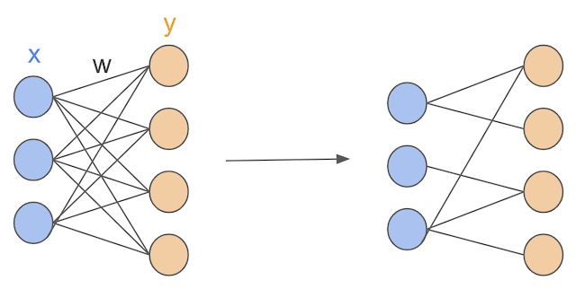
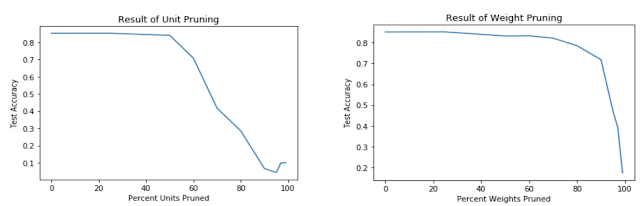

# Sparsifying Neural Networks

Neural networks with trillions of parameters are sought after due to their improved generalization capabilities. However, training such large network architectures often come with training and data efficiency trade-offs.

What if we can train a very large network first then decrease it's size?
That's the idea of sparse networks, where each layer's neurons are only connected to a few others in the next. Here, I explore the effects of different ways of "pruning" a network, save on matrix operations, and evaluate the maximum amount of sacrifice we can afford to make on accuracy.

## Two Methods
To achieve a sparsity of some k%, we rank, according to this specified magnitude, each respective pruning parameter: weight or output neuron.

Note: the weight matrices leading to logits should not be pruned.

### Given a ReLU(xW) layer of a neural network:
#### Weight Pruning
Delete connections between nodes by setting their weight values in weight matrix W to 0. Here, each individual weight in the weight matrices were set to 0 according to their L1-norm, i.e. if they were amongst the smallest k%.

#### Unit Pruning
Delete the candidate neuron in the network by setting entire columns in W to 0. Here, columns of the weight matrices were pruned if their L2-norm was amongst the smallest k%.

### Percent Sparsity vs. Percent Accuracy
Applying the two pruning methods, I expected the accuracy to decline significantly when the network was increasingly sparse. However, there should be some plateau before the decrease as computing the weights of fully connected hidden layers was hypothesized to be unnecessary in outputting the correct prediction. I trained with epochs 5, 10, and 20 and noticed that the accuracy wasn't too different so I just saved and loaded the 5-epoch model.

Generally, both methods of pruning showcased some time of plateau and a consistently negative derivative, which implies the insignificance of up to some threshold number of parameters in the network towards the contribution of the output prediction. This threshold value was around 70-75% sparsity in weight pruning and just under 50% sparsity in the unit pruning, leading to weight pruning being an overall more effective method than unit pruning.

## Final Thoughts
In the weight pruning method, we are not deleting entire nodes hence this would be why the plateau extends further than in the unit pruning plot, as there is less of a change in the network architecture per increment in the k percentage value. This large pruning of weights without affecting performance much is indicative of the major effect of network size on classification rate and minor effect on accuracy.

Meanwhile in the unit pruning experiment, deleting nodes seemed to have a more drastic effect on the network's performance from what I suspect to be due to the decrease in the size of the network compared to the weight-only pruning. Perhaps deleting certain output nodes shouldn't have had such a large effect if they were selected according to an alternate heuristic to simply the lowest k%. Unit pruning compared to weight pruning is more variable most likely due to the deletion mechanism. A weakly ranked node may in fact have some crucial connections but it may still be ruled out because it has fewer of those overall, making it seem like it carried a lot more insignificant weights.

These insights suggest that pruning is highly favourable since it could provide robust performance and simplify network architecture, which could make training and hyperparameter tuning much more efficient by reducing the number of evaluations on the otherwise thousands of parameters in a neural network.

--------------------------------------------------------------------

If you're curious, I've released some of my (I apologize in advance, poorly modularized) code [here](https://github.com/xwinxu/Pruning-NN).
